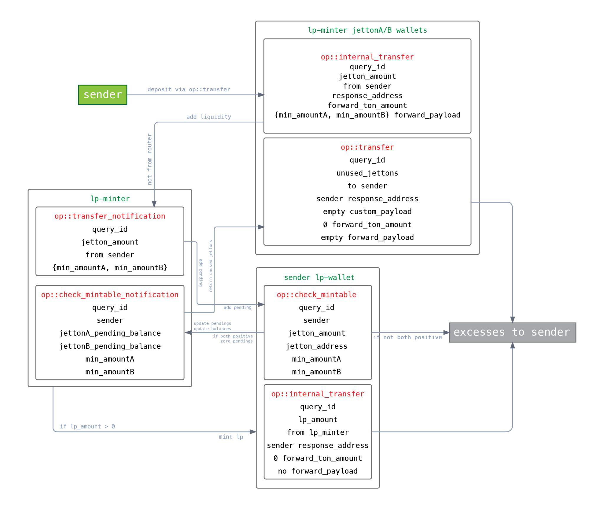

## Intro
When developing contracts for the Ethereum Virtual Machine, you generally break up the project into several contracts for convenience only. 
In some cases, it is possible to implement all the functionality in one contract, and even where contract splitting was necessary (for example, Liquidity Pairs in the Automated Market Maker) this did not lead to any special difficulties. 
* In EVM transactions are executed in their entirety: either everything works out, or everything reverts.

In TON, it is strongly recommended to avoid “unbounded data structures” and split a single logical contract into small pieces, each of which manages a small amount of data. The basic example is the implementation of TON Jettons (this is TON's version of Ethereum's ERC-20 token standard). 

* In TON the project is splitted in several small parts.

## Contract Sharding
* Jetton structure:
  * `jetton-minter` stores `total_supply`, `minter_address`, metadata, `jetton_wallet_code`
  * many `jetton-wallet` store owner's address, their balance, jetton-minter address, `jetton_wallet_code`

Briefly, we have:

One jetton-minter that stores total_supply, minter_address, and a couple of refs: token description (metadata) and jetton_wallet_code.
And a lot of jetton-wallet, one for each owner of these jettons. Each such wallet stores only the owner's address, their balance, jetton-minter address, and a link to jetton_wallet_code.
This is necessary so that the transfer of Jettons occurs directly between wallets and does not affect any high-load addresses, which is fundamental for the parallel processing of transactions.

That is, get ready so that your contract turns into a "group of contracts", and they will actively interact with each other.

What follows from this?

## Partial Execution of Transactions is Possible
A new unique property appears in the logic of your contract: partial execution of transactions.

For example, consider the message flow of a standard TON Jetton:


Here is the TON Jetton message flow. What follows from the diagram:

1. sender sends an op::transfer message to its wallet (sender_wallet)
1. sender_wallet reduces the token balance
1. sender_wallet sends an op::internal_transfer message to the recipient's wallet (destination_wallet)
1. destination_wallet increases its token balance
1. destination_wallet sends op::transfer_notification to its owner (destination)
1. destination_wallet returns excess gas with op::excesses message on response_destination (usually sender)

Note that if the destination_wallet was unable to process the op::internal_transfer message (an exception occurred or the gas ran out), then this part and subsequent steps **will not be executed**. 

But the first step (reducing the balance in sender_wallet) **will be completed**. The result is a partial execution of the transaction, an inconsistent state of the Jetton, and, in this case, the loss of money.

In the worst case scenario, all the tokens can be stolen in this way. Imagine that you first accrue bonuses to the user, and then send an op::burn message to their Jetton wallet, but you cannot guarantee that the op::burn will be processed successfully.

## Always Draw Message Flow Diagrams
Even in a simple contract like a TON Jetton, there are already quite a few messages, senders, receivers, and pieces of data contained in messages. Now imagine how it looks when you’re developing something a little more complex, like a decentralized exchange (DEX) where the number of messages in one workflow can exceed ten.



At CertiK, we use the DOT language to describe and update such diagrams during the course of the audit. That's what we recommend the developers as well.

Unlike in Ethereum smart contracts where the external call **must** execute before the execution continues,
in TON the external call is a message that will be delivered and processed after some time in some new conditions. That requires much more attention from the developer.

## Avoid Fails and Catch Bounced Messages

* Determine the "entry points" of the "contracts group".
* Check there the payload, gas supply, message origin to minimaze the risk of failure.
* In other message handlers ("consequences") check message origin. Other checks are "asserts".
* Can't afford failing in "consequences". If can fail - review message flow.

Using the message flow, first define the entry point. This is the message that starts the cascade of messages in your group of contracts (“consequences”). 
It is here that everything needs to be checked (payload, gas supply, etc.) in order to minimize the possibility of failure in subsequent stages.

If you are not sure whether it will be possible to fulfill all your plans (for example, whether the user has enough tokens to complete the deal), it means that the message flow is probably built incorrectly.

In subsequent messages (consequences), all throw_if()/throw_unless() will play the role of asserts rather than actually checking something.

## Processing bounced messages
Many contracts also process bounced messages just in case.

For example, in TON Jetton, if the recipient's wallet cannot accept any tokens (it depends on the logic for receiving), then the sender's wallet will process the bounced message and return the tokens to its own balance.

```cpp
() on_bounce (slice in_msg_body) impure {
    in_msg_body~skip_bits(32);  ;;0xFFFFFFFF

    (int balance, slice owner_address, slice jetton_master_address, cell jetton_wallet_code) = load_data();

    int op = in_msg_body~load_op();

    throw_unless(error::unknown_op, (op == op::internal_transfer) | (op == op::burn_notification));

    int query_id = in_msg_body~load_query_id();
    int jetton_amount = in_msg_body~load_coins();

    balance += jetton_amount;
    save_data(balance, owner_address, jetton_master_address, jetton_wallet_code);
}
```
In general, we recommend processing bounced messages, however, they can’t be used as a means of full protection from failed message processing and incomplete execution.

Firstly, it takes gas to send a bounced message and process it, and if there isn’t enough provided by the sender, then no bounced.

## Can't "re-bounce" messages


Secondly, TON does not provide for a chain of jumps. This means a bounced message can't be re-bounced. For example, if the `destination` can't process `op::transfer_notification`, then the `sender_wallet` can't find this out via bounced messages.

## Expect a Man-in-the-Middle of the Message Flow

* A message cascade can be processed over many blocks. 
* Assume that while one message flow is running, an attacker can initiate a second one in parallel. 

That is, if a property was checked at the beginning (e.g. whether the user has enough tokens), do not assume that at the third stage in the same contract they will still satisfy this property.

## Use a Carry-Value Pattern

We came up to the most important advice: use Carry-Value Pattern.

In TON Jetton, this is demonstrated: 
* sender_wallet **subtracts the balance** and **sends it** with an op::internal_transfer message to destination_wallet, 

and it, in turn, 
* **receives the balance** with the message and **adds it** to its own balance (or bounces it back). 
* The value is transferred, not the message.

## Can't get Jetton balance on-chain

You have probably already noticed that Jetton implementation doesn't allow you finding out **your Jetton balance on-chain**. That is because such a question does not fit the pattern. By the time the response to the op::get_balance message reaches the requester, this balance could already have been spent by someone.

But let's implement an alternative:


1. master sends a message op::provide_balance to the wallet
1. wallet zeroes its balance and sends back op::take_balance
1. master receives the money, decides if it has enough, and either uses it (debits something in return) or sends it back to wallet

So, this is somewhat like getting the balance.

## Return Value Instead of Rejecting

From Carry-Value Pattern, it follows that your group of contracts will often receive not just a request, but a request **along with a value**. So you can't just refuse to execute the request (via throw_unless()), you have to send the Jettons back to the sender.


For example, a typical flow start:

1. sender sends an op::transfer message via sender_wallet to your_contract_wallet, specifying forward_ton_amount and forward_payload **for your contract**.
1. sender_wallet sends an op::internal_transfer message to your_contract_wallet.
1. your_contract_wallet sends an op::transfer_notification message to your_contract, delivering **forward_ton_amount, forward_payload, and the sender_address and jetton_amount**.
1. **And here** in your contract in handle_transfer_notification() the flow begins.

There you need to figure out 
what kind of request it was, 
whether there is enough gas to complete it, 
and whether everything is correct in the payload. 

At this stage, you should not use throw(), because then the Jettons will **simply be lost**, and the request will not be executed. It's worth using the try-catch statements. If something does not meet the expectations of your contract, the Jettons must be returned.

## Return jettons to sender_address

But be careful, 
* Send returning `op::transfer` to `sender_address`, not to any real Jetton wallets.
* You don't know if you got the `op::transfer_notification` from a real wallet or someone is joking.
* If your contract receives unexpected or unknown Jettons, they must also be returned.

## Resume

* TON requires much more design efforts from the developer to avoid "unbounded data structures" and to allow "infinite sharding paradigm".
* Even with the correct design and using of "carry-value pattern" the TON developer has to take into account the async nature of TON messages.
* Accepting the Jettons requires manual careful payload analysis and checking the conditions.
* Return the value via `sender_address` since messages can be forged.